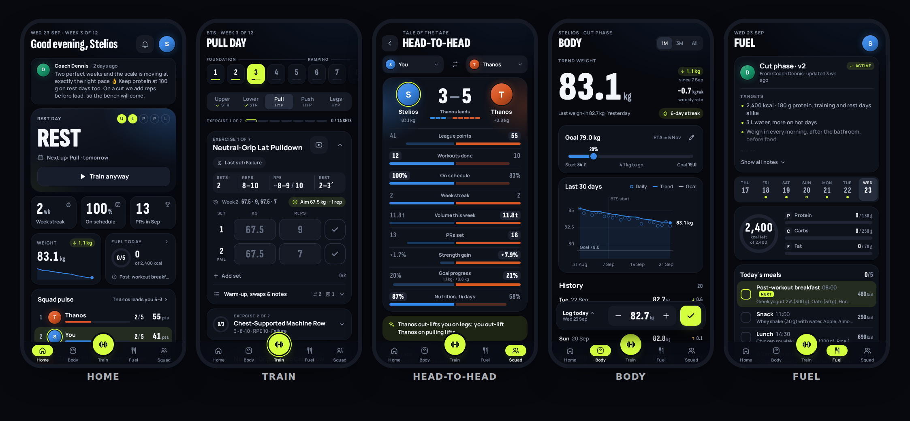

# Eimaste Cool Training · Είμαστε Cool

A training app for a small squad of friends, meant to be opened from a link.
Log workouts from the 12-week program, track body weight with charts, follow the meal plans the coach uploads, and see everyone's progress.
Friendly competition pushes each person to pull the others forward.



> **Set it up for the squad:** follow [docs/SETUP.md](docs/SETUP.md). It takes about 15 minutes: GitHub Pages plus a free Supabase project.
> Until then the app runs in **demo mode**, with sample data kept on your device, so you can try every screen.

## What's inside

| | |
| --- | --- |
| **Home** | Today's workout, week streak, on-schedule %, PRs, weight trend, today's nutrition, the coach's note, nudges from friends and a squad pulse. A different dashboard for the coach. |
| **Train** | The original BTS logbook, rebuilt. Weeks 1–12, the five days and every exercise's sets, reps, RPE, rest and last-set technique. Last time's numbers appear as placeholders. Each exercise gets an "aim" suggestion. PR badges appear live, with estimated 1RM. Substitutions and remembered machines are there. A warm-up ramp is calculated from your working weight. There's a rest timer that follows you across screens, with sound and vibration, and the screen stays awake. A finish sheet with a summary and how it felt. Plus exercise history charts. |
| **Body** | Weigh-ins with a smoothed trend, a goal with an ETA, the weekly rate and a history. Body fat and waist are optional. A quick-log dock sits within reach of your thumb, and there's a squad "% change" race. |
| **Fuel** | The coach's meal plan: daily targets, meals, notes and attached PDFs or photos. A daily check-in lets you tick meals, rate the day and count water. Adherence shows as a heatmap and a streak. |
| **Squad** | Everyone's progress, a league with points (workouts, PRs, perfect weeks, weigh-ins, on-plan days), badges, and an activity feed with kudos and nudges. **Head-to-head** shows the tale of the tape, the workout race, weekly volume, a lift duel and weight change. Plus member profiles. |
| **Coach console** | Invite links (via WhatsApp or anything else) and adding members. Set start dates, goals and coach notes. Create and upload meal plans. Import and export programs (JSON or CSV, with a template). Back up everything. |
| **Everywhere** | English and Greek, light and dark themes, phone-first layouts with a desktop layout too. It installs as an app (PWA) and works offline at the gym, syncing later. Data updates live when a friend logs something. |

## How it works

- **Frontend:** React 19 + TypeScript + Vite, hash routing, and a hand-made design system called "Night Session" (`src/ui`, tokens in `src/styles/tokens.css`). Charts are dependency-free SVG (`src/ui/charts`).
- **Data:** one small store (`src/data/store.ts`) holds the whole squad's data in memory. Writes are optimistic and go through an outbox saved on the device with retries, so logging a workout offline is safe: it survives the app being closed and even the session expiring (it is sent after signing in again). If two devices edit the same row, the most recent edit wins, and an older copy arriving late never overwrites it. Profiles, which the coach and the athlete both edit, are merged field by field.
- **Backends:** `src/data/backend`
  - `LocalBackend` is the demo mode. It keeps everything in the browser and is seeded by `src/data/demo/seed.ts`.
  - `SupabaseBackend` is the shared mode: Postgres with row-level security, Auth, Storage for meal-plan files, and Realtime for live updates.
    Logins are password-only: each person signs in as `<name>-<invite>@<authEmailDomain>` behind the scenes (by default the site's own address, e.g. `dennis1kan.github.io`), and nobody receives e-mail.
- **Stats:** `src/lib/stats` holds pure, unit-tested functions for the schedule, PRs and e1RM, volume, weight trend, adherence, league points, head-to-head, feed and badges.
- **Security model** (`supabase/schema.sql`):
  - Only signed-in squad members can read squad data, and each member can write only their own rows.
  - The coach manages everyone.
  - Fields that belong to the coach (role, coach note, "competes") are protected by a trigger.
  - Weight privacy: *Private* is enforced by the database, so nobody but you and the coach can read your weigh-ins.
    *Change only* (the default) is a display choice: squad screens show your progress (kg lost or gained, and %), never your weigh-ins, but the exact numbers still reach squad mates' devices.
  - Meal-plan files are visible only to their owner and the coach.
  - Invite codes are 12 characters, single-use and rotate; each login gets at most 5 wrong codes per hour.
  - An update older than the stored row is ignored, so a phone replaying an old queue cannot undo newer edits.
  - The app refuses to start if `config.js` holds the secret (service_role) key.
  - The rules are tested against a local Postgres by `npm run test:db`.

## Development

```bash
npm install
npm run dev          # http://localhost:5173 (demo mode unless public/config.js has Supabase keys)
npm test             # unit + component tests (vitest)
npm run typecheck
npm run build        # production build in dist/ (+ service worker)
npm run test:db      # schema + row-level-security tests on a throwaway local PostgreSQL 16
```

**Layout:**
- `src/app`: the shell (tab bar and sidebar, account sheet, banners), routes and theme
- `src/features/<area>`: one folder per area (home, train, body, fuel, squad, coach, auth, settings), each with its own strings in English and Greek (`messages.ts`)
- `src/ui`: the UI kit (its contract is in `src/ui/README.md`), plus charts
- `src/data`: types, store, backends, the built-in program (`programs/bts.json`), demo data
- `src/lib`: dates, units, formatting, stats, importers (program JSON/CSV, the old logbook CSV)
- `supabase`: database schema and tests
- `design/mockups`: the three design directions explored (the app uses *Night Session*)

## Programs

The built-in program is the 12-week BTS logbook: Foundation block in weeks 1–5, then the Ramping block in weeks 6–12. The weekly pattern is Upper, Lower, rest, Pull, Push, Legs, rest.
The coach can import new programs in the original logbook JSON format or as CSV. **Coach → Programs → Download template** gives you the exact columns.
